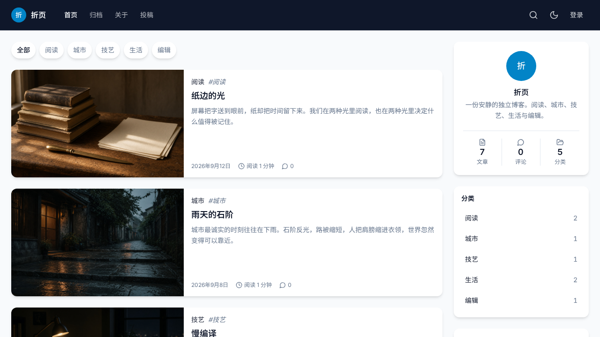

# 折页 Folio

写给工程师的独立博客。栏目按语言分：TypeScript、Rust、Go、Python、SQL、Zig、架构。正文带可运行的代码围栏、双链互引、会员抢先阅读，以及给写作 Agent 用的 MCP 接口。

[](./LICENSE)
[](https://github.com/xxww0098/folio/releases)
[](https://github.com/xxww0098/folio/pkgs/container/folio)

**仓库：** [github.com/xxww0098/folio](https://github.com/xxww0098/folio)  
**镜像：** `ghcr.io/xxww0098/folio`  
**许可证：** MIT



## 功能

- 技术向 Markdown：语言标签、文件名、行号、高亮行、Diff、一键复制
- 双链：`[[slug]]` / `[[标题#小节]]` / `[[slug#^block|显示名]]`，阅读页给出链和反向链接
- 会员：公开 / 抢先 N 天 / 专享；没权限时服务器只下发预览，正文不会下到浏览器
- 附件、回收站、文章版本、角色（作者 / 编辑 / 管理员）
- Obsidian 插件：个人令牌发布、拉回、上传图片
- MCP：写作 Agent 远程列稿、改稿、推送（`/api/mcp`，同一类 `folio_` 令牌）
- 六套内置主题，顶栏切换
- 后台入口：控制台可设一段秘密路径；开启后直接打开 `/console` 显示成普通 404
- 单账户：首次启动生成站长邮箱和密码，没有公开注册
- 备份：控制台导出 / 导入整站 JSON，方便换机器
- 存储：图片默认写进 Postgres；控制台可改成 S3 兼容对象存储（R2 / MinIO / OSS）

## 用 Docker 自托管

需要 [Docker Compose v2](https://docs.docker.com/compose/)。第一次可以从源码构建；之后版本跟着 **GitHub Release** 走。

### 1. 第一次启动

```sh
git clone https://github.com/xxww0098/folio.git
cd folio
cp .env.example .env
```

编辑 `.env`：

| 变量 | 说明 |
| --- | --- |
| `BETTER_AUTH_URL` | 浏览器访问的 origin。本机 `http://localhost:8011`，公网请用 `https://你的域名` |
| `BETTER_AUTH_SECRET` | 会话签名密钥，生产用 `openssl rand -hex 32` |
| `POSTGRES_PASSWORD` | 数据库密码，不要包含 `@ : / # ?` |
| `FOLIO_PORT` | 宿主机前端端口，默认 `8011` |
| `FOLIO_VERSION` | 镜像 tag。第一次可保持 `latest` |
| `FOLIO_ADMIN_EMAIL` | 可选。站长邮箱；不填则随机生成 |
| `FOLIO_ADMIN_PASSWORD` | 可选。至少 8 位；不填则随机生成 |

```sh
docker compose up -d --build
docker compose logs folio
```

日志里会打印 **后台入口** 和 **站长账户**（首次启动当场生成并写入数据库）：

```
[folio] ------------------------------------------------------------
[folio] 安装完成，请打开浏览器访问：
[folio]   地址    http://localhost:8011/<入口>
[folio]   邮箱    <随机或你填的邮箱>
[folio]   密码    <随机或你填的密码>
[folio] 密码只显示这一次，请立刻保存。
[folio] ------------------------------------------------------------
```

打开那条入口地址才能进控制台；直接访问 `/console` 会显示普通 404。站点只有一个账户，没有公开注册。之后重启只再打印入口和邮箱，不再打印密码。

生产请把站点放在 HTTPS 反向代理后面。会话 Cookie 用 `__Host-` 前缀：本机 `localhost` 可以用 HTTP，公网必须 HTTPS。

Caddy 示例：

```caddy
blog.example.com {
  reverse_proxy 127.0.0.1:8011
}
```

只备份 Docker volume `folio-db` 也可以（文章、会员默认在 Postgres 里；若把图片改到对象存储，桶要单独留着）。换机器更稳妥的是导出一份 JSON（导出时会把对象存储里的图拉进文件）：

控制台 → **备份** → 导出。新机器启动后用同一页导入，或：

```sh
docker compose exec -T folio node scripts/export-db.mjs > folio.json
docker compose exec -T folio node scripts/import-db.mjs < folio.json
```

导入会覆盖目标库的全部内容。会话不会跟着备份走，导入后重新登录。

### 对象存储（可选）

不配则图片写进 Postgres。图多了可以改成 S3 兼容存储：Cloudflare R2、MinIO、阿里云 OSS、AWS S3。

控制台 → **存储** 填写 Endpoint / 桶 / 密钥，或在 `.env` 里设置：

| 变量 | 说明 |
| --- | --- |
| `FOLIO_S3_ENDPOINT` | 例如 `https://<id>.r2.cloudflarestorage.com` 或 `http://minio:9000` |
| `FOLIO_S3_BUCKET` | 桶名 |
| `FOLIO_S3_REGION` | R2 用 `auto`；AWS 填区域 |
| `FOLIO_S3_ACCESS_KEY` / `FOLIO_S3_SECRET_KEY` | 密钥 |
| `FOLIO_S3_FORCE_PATH_STYLE` | MinIO 设 `true`；AWS / OSS 一般 `false` |
| `FOLIO_S3_PUBLIC_URL` | 可选。桶的公开/CDN 前缀，填了之后读图会 302 过去 |
| `FOLIO_S3_PREFIX` | 对象键前缀，默认 `folio` |

页面上保存的设置优先于环境变量。文章里的图片地址默认仍是 `/api/files/{id}`。写文章时把鼠标放到图上，或右键，可以改成对象存储的公开地址。已有图片用同一页的「迁到对象存储 / 收回数据库」。

### 2. 从 GitHub Release 升级

新版本以 GitHub Release 发布（tag `v*`），同时打出多架构镜像：

`ghcr.io/xxww0098/folio:<tag>`（`linux/amd64`、`linux/arm64`）

```sh
./scripts/update-from-release.sh          # 读最新 Release，拉取并重启
./scripts/update-from-release.sh --check  # 只看有没有新版本
```

脚本会把 `.env` 里的 `FOLIO_VERSION` 写成最新 tag，再 `docker compose pull && up`。指定版本：

```sh
FOLIO_VERSION=v0.1.3 docker compose pull folio
FOLIO_VERSION=v0.1.3 docker compose up -d
```

控制台页会显示当前版本；GitHub 上有更新时会提示跑上面的脚本。

没有克隆仓库、只拿 Compose 文件也可以：

```sh
mkdir folio && cd folio
curl -fsSO https://raw.githubusercontent.com/xxww0098/folio/main/docker-compose.yml
curl -fsSO https://raw.githubusercontent.com/xxww0098/folio/main/.env.example
cp .env.example .env
# 编辑 .env，把 FOLIO_VERSION 写成某个 Release tag
docker compose up -d
```

如果 `docker pull` 提示未授权，到 [GHCR 包装页](https://github.com/xxww0098/folio/pkgs/container/folio) 把可见性设为 Public。

### 3. 发布新版本（维护者）

```sh
git tag v0.1.3
git push origin v0.1.3
```

推送 `v*` 标签后，GitHub Actions 会：构建 `amd64` / `arm64` 镜像 → 推送到 GHCR → 创建 GitHub Release。

## 本地开发

需要 Node.js 22。

```sh
npm ci
VITE_AUTH_ENABLED=true VITE_FOLIO_EMAIL_PASSWORD=true npm run dev
```

开发服默认 `0.0.0.0:8080`。不设 `DATABASE_URL` 时用内嵌 PGLite；设了则连 Postgres。

```sh
npm run typecheck
npm run test
```

## 环境变量

| 变量 | 何时生效 | 说明 |
| --- | --- | --- |
| `DATABASE_URL` | 运行时 | Postgres 连接串。Compose 会自动注入。 |
| `BETTER_AUTH_URL` | 运行时 | 站点对外 origin |
| `BETTER_AUTH_SECRET` | 运行时 | 会话签名密钥 |
| `VITE_AUTH_ENABLED` | **构建时** | `"true"` 打开登录 |
| `VITE_FOLIO_EMAIL_PASSWORD` | **构建时** | `"true"` 打开邮箱登录（自托管镜像默认打开，无公开注册） |
| `VITE_FOLIO_VERSION` | **构建时** | 写入前端的版本号，发 Release 时由 CI 填入 |
| `FOLIO_VERSION` | Compose | 镜像 tag |
| `FOLIO_PORT` | Compose | 宿主机前端端口，默认 8011 |
| `FOLIO_ADMIN_EMAIL` | 运行时 | 可选。首次启动创建站长时使用；已有账户后忽略 |
| `FOLIO_ADMIN_PASSWORD` | 运行时 | 可选。至少 8 位；已有账户后忽略 |
| `FOLIO_ADMIN_NAME` | 运行时 | 可选。显示名，默认「站长」 |

Vite 变量在构建时打进前端，改它们必须重新 `docker compose build`。不要把密钥写进源码或提交 `.env`。

## 写作接口

### Obsidian

控制台签发个人令牌（`folio_` 开头），下载插件包放到库的 `.obsidian/plugins/folio/`。命令：发布、拉取、上传图片。说明页：`/obsidian`。

### Agent / MCP

Streamable HTTP 端点：`POST /api/mcp`  
请求头：`Authorization: Bearer folio_…`

Cursor 示例：

```json
{
  "mcpServers": {
    "folio": {
      "url": "https://你的站点/api/mcp",
      "headers": {
        "Authorization": "Bearer folio_你的令牌"
      }
    }
  }
}
```

工具包括 `list_posts`、`get_post`、`publish_post`、`update_post`、`delete_post`、`upload_image` 等。说明页：`/mcp`。

## Markdown 方言

````md
```ts:src/lib/parse.ts {3-5}
export function parse(raw: string) {
  return raw.trim();
}
```
````

双链：`[[slug]]`、`[[标题]]`、`[[slug#小节]]`、`[[slug#^block|显示名]]`。

YAML 头（Obsidian / MCP 推送）：

```yaml
---
title: 判别联合笔记
slug: ts-unions
topic: TypeScript
tags:
  - TypeScript
status: published
access: public
---
```

`access`：`public` | `early` | `paid`。抢先稿用 `exclusiveDays`。

## 项目结构

```
src/routes/          文件路由
src/components/      站点壳与业务组件
src/lib/blog/        文章、Markdown、双链
src/lib/membership/  会员与正文闸门
src/lib/mcp/         Agent MCP
src/lib/obsidian/    笔记同步
migrations/          Postgres schema
Dockerfile           多阶段构建
docker-compose.yml   Postgres + 应用
scripts/update-from-release.sh
```

贡献者约定见 [`AGENTS.project.md`](./AGENTS.project.md)。Issue 与 Pull Request 都欢迎。

## 许可

[MIT](./LICENSE)
